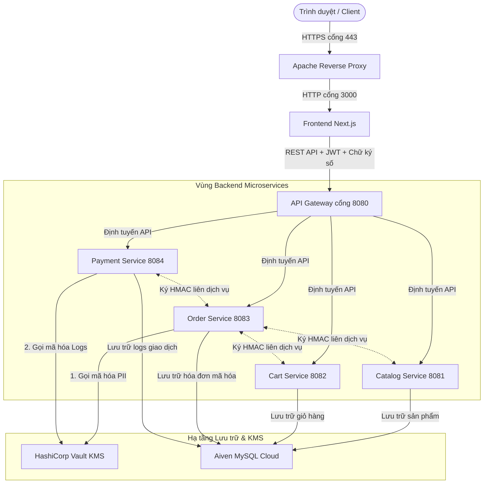
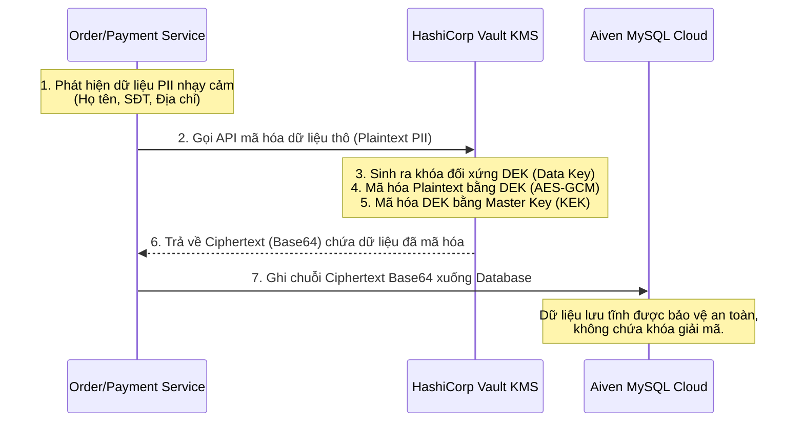

PHẦN MỞ ĐẦU

1.1. Tính cấp thiết của đề tài

Trong kỷ nguyên số hóa, các hệ thống thương mại điện tử (TMĐT) xử lý khối lượng khổng lồ giao dịch tài chính và dữ liệu cá nhân nhạy cảm mỗi ngày. Tuy nhiên, các kiến trúc web truyền thống thường chỉ tập trung vào bảo mật đường truyền (HTTPS/TLS) và xác thực phiên (Session/JWT). Lỗ hổng lớn nhất của mô hình này là thiếu tính Chống chối bỏ (Non-repudiation) đối với các hành vi giao dịch. Khi xảy ra tranh chấp hoặc gian lận đơn hàng, hệ thống không có bằng chứng mật mã học hợp pháp để chứng minh một tài khoản cụ thể đã thực sự thực hiện giao dịch, do các khóa đối xứng (như HMAC) hoặc mật khẩu hoàn toàn có thể bị giả mạo bởi chính quản trị viên hệ thống hoặc kẻ tấn công chiếm quyền máy chủ.

Do đó, việc ứng dụng Chữ ký số bất đối xứng (Asymmetric Digital Signature) trực tiếp từ thiết bị người dùng là giải pháp mật mã học duy nhất giải quyết triệt để bài toán này. Bằng việc ký số đơn hàng bằng Khóa bí mật (Private Key) riêng tư của người mua và xác thực bằng Khóa công khai (Public Key) ở Backend, giao dịch sẽ đạt được trạng thái Không thể thay đổi (Immutability) và Chống chối bỏ tuyệt đối. Kết hợp với việc mã hóa dữ liệu tĩnh nhạy cảm (PII) qua cơ chế mã hóa phong bì (Envelope Encryption) và quản lý khóa tập trung (KMS), đồ án hướng tới xây dựng một kiến trúc mật mã học ứng dụng toàn diện, giải quyết các thách thức an toàn giao dịch thực tế trong TMĐT.

1.2. Mục đích của đề tài

Mục đích cốt lõi của đề tài là thiết kế, triển khai và đánh giá thực nghiệm một hệ thống giao dịch thương mại điện tử bảo mật bằng mật mã học ứng dụng, cụ thể:
- Xây dựng quy trình ký số giao dịch bất đối xứng (Digital Signature) từ Client lên Backend để đảm bảo tính chống chối bỏ cho mỗi đơn hàng được tạo ra.
- Thiết kế luồng bảo vệ dữ liệu cá nhân (địa chỉ, số điện thoại) tĩnh trong cơ sở dữ liệu bằng thuật toán mã hóa đối xứng AES-256-GCM kết hợp mã hóa phong bì qua dịch vụ quản lý khóa tập trung (KMS) HashiCorp Vault.
- Xây dựng chỉ mục tìm kiếm trên dữ liệu đã mã hóa (Blind Index) bằng thuật toán HmacSHA256 để đảm bảo tính năng truy vấn thông tin của hệ thống hoạt động bình thường mà không cần giải mã cơ sở dữ liệu.
- Thiết lập kênh truyền dữ liệu an toàn HTTPS/TLS 1.3 ngoài internet và bảo mật giao tiếp nội bộ giữa các microservices bằng chữ ký đối xứng HMAC kèm Timestamp để chống tấn công phát lại (Replay Attacks).

1.3. Cách tiếp cận và phương pháp nghiên cứu

1.3.1. Đối tượng nghiên cứu
- Các thuật toán mật mã học đối xứng và bất đối xứng: AES-256-GCM, RSA, ECDSA, SHA3-512, HMAC-SHA256.
- Các chuẩn và công nghệ hạ tầng bảo mật: Giao thức TLS 1.3, mã hóa phong bì (Envelope Encryption), Key Management Service (KMS) HashiCorp Vault, và dịch vụ cơ sở dữ liệu đám mây Aiven MySQL Cloud.
- Tính chất an toàn thông tin mật mã học: Confidentiality (Mã hóa tĩnh PII), Integrity (JWT Signature, HMAC liên dịch vụ), Authenticity (Xác thực người dùng), và Non-repudiation (Chữ ký số giao dịch).

1.3.2. Phạm vi nghiên cứu
- Phạm vi kỹ thuật: Triển khai thực nghiệm mô hình ứng dụng mật mã học chạy trực tiếp (Native Hosting) trên môi trường máy chủ vật lý, kết hợp cơ sở dữ liệu đám mây MySQL Cloud. Dữ liệu thẻ được giả lập hoàn toàn qua luồng VietQR Tokenization (Zero-PAN).
- Giới hạn nghiên cứu: Đồ án tập trung vào việc thiết kế cấu trúc mật mã để hệ thống tự động bảo vệ dữ liệu và giao dịch, không nghiên cứu lý thuyết toán học thuần túy của các thuật toán mã hóa và không thực hiện các bài test tấn công ứng dụng web thông thường.

1.4. Phân tích các công trình có liên quan

Nghiên cứu về an toàn thông tin trong giao dịch điện tử cho thấy sự chuyển dịch mạnh mẽ từ bảo mật mạng thông thường sang bảo mật dựa trên mật mã học cấp ứng dụng:
- Các nghiên cứu về xác thực phiên chỉ ra rằng JWT (JSON Web Token) rất dễ bị khai thác nếu không xác thực chữ ký chặt chẽ (lỗi alg:none). Đồ án khắc phục lỗi này bằng cách thiết lập bộ lọc Nimbus-JOSE-JWT xác thực bắt buộc thuật toán HS256 ở API Gateway.
- Về tính chống chối bỏ trong thanh toán: Phần lớn ứng dụng thương mại điện tử hiện tại chỉ sử dụng HTTPS để bảo vệ đường truyền, điều này chỉ chống nghe lén chứ không chống chối bỏ. Các công trình khoa học khuyến nghị sử dụng chữ ký số bất đối xứng (Digital Signature) để làm bằng chứng pháp lý bảo vệ giao dịch trực tuyến.
- Về quản lý khóa: Các tài liệu chuẩn của NIST (NIST SP 800-57) khuyến nghị tuyệt đối không lưu trữ khóa mật mã trong mã nguồn. Cơ chế mã hóa phong bì (Envelope Encryption) thông qua KMS như HashiCorp Vault là giải pháp tối ưu được thừa nhận rộng rãi để cô lập khóa mật mã khỏi lớp ứng dụng và cơ sở dữ liệu.

==========================================================================================

CHƯƠNG 1: TỔNG QUAN ĐỀ TÀI VÀ KIẾN TRÚC HỆ THỐNG (WEB STRUCTURE)

1.1. Kiến trúc Microservices tổng thể của hệ thống E-Commerce

Hệ thống được xây dựng theo kiến trúc Microservices phân tán nhằm đảm bảo tính cô lập dữ liệu, khả năng mở rộng độc lập và tăng cường ranh giới bảo mật (Security Boundaries). Khác với kiến trúc nguyên khối (Monolithic), kiến trúc Microservices cho phép mỗi vùng nghiệp vụ hoạt động như một thực thể riêng biệt, sở hữu cơ sở dữ liệu riêng và chỉ giao tiếp với nhau qua các giao thức mạng được bảo mật mật mã học.

Kiến trúc tổng thể của hệ thống được chia làm 4 lớp chức năng rõ ràng:

1. Lớp Cửa ngõ (API Gateway): Đây là điểm tiếp nhận duy nhất cho toàn bộ yêu cầu từ Client gửi vào Backend. Gateway thực hiện vai trò kiểm soát an ninh tập trung, giải mã và xác thực tính toàn vẹn của Token phiên (JWT), sau đó định tuyến yêu cầu đến các microservices tương ứng nằm trong vùng mạng nội bộ.

2. Lớp Dịch vụ Nghiệp vụ (Backend Microservices): Gồm 4 dịch vụ nghiệp vụ chạy trên các cổng mạng độc lập:
- Catalog Service (Cổng 8081): Quản lý dữ liệu sản phẩm, giá cả và tồn kho.
- Cart Service (Cổng 8082): Lưu trữ tạm thời trạng thái giỏ hàng của người dùng.
- Order Service (Cổng 8083): Xử lý quy trình đặt hàng, tính toán lại tổng tiền đơn hàng và phối hợp xác thực chữ ký số giao dịch chống chối bỏ.
- Payment Service (Cổng 8084): Xử lý giao dịch thanh toán VietQR, đối soát giao dịch và chạy bộ quy tắc chấm điểm rủi ro giao dịch (PaymentSecurityGateway).

3. Lớp Lưu trữ Dữ liệu Đám mây (MySQL Cloud): Thay vì cài đặt database cục bộ, hệ thống kết nối với dịch vụ cơ sở dữ liệu quản lý đám mây Aiven MySQL Cloud. Mỗi microservice sở hữu một schema riêng biệt trên Cloud, được cấu hình tường lửa chỉ cho phép IP của máy chủ backend kết nối.

4. Lớp Quản lý Khóa (KMS - HashiCorp Vault): Chạy độc lập dưới nền để cung cấp dịch vụ mã hóa/giải mã và quản lý vòng đời khóa mật mã tập trung. Các microservices không được phép lưu trữ khóa đối xứng mà phải gọi qua APIs bảo mật của Vault.

Sơ đồ mô tả luồng hoạt động và kiến trúc kết nối tổng thể của hệ thống:

1.2. Phân rã cấu trúc ứng dụng và Giao diện Web

1.2.1. Lớp Frontend Next.js
Lớp Frontend được phát triển bằng Next.js, đóng vai trò hiển thị giao diện người dùng và thực hiện các tính toán mật mã học ở Client-side:
- Giao diện người dùng: Cho phép duyệt sản phẩm, thêm vào giỏ hàng, điền thông tin vận chuyển và thực hiện thanh toán qua giao diện quét mã QR động VietQR.
- Giao diện Admin Dashboard: Dành cho quản trị viên theo dõi trạng thái đơn hàng, đối soát các giao dịch thanh toán, quản lý danh sách sản phẩm và cấu hình số tài khoản ngân hàng nhận tiền.
- Cơ chế ký số tại Client: Khi người dùng thực hiện Checkout, trình duyệt Next.js sử dụng thư viện mã hóa của Client (Web Crypto API) để băm dữ liệu đơn hàng (gồm mã đơn hàng, tổng tiền, danh sách sản phẩm và thời gian ký) và ký số bằng Khóa bí mật (Private Key) được sinh ra cho tài khoản đó. Chữ ký số này được gửi kèm lên Backend để phục vụ tính năng chống chối bỏ.

1.2.2. Lớp API Gateway (Spring Cloud Gateway)
Chạy trên cổng vật lý 8080 của máy chủ Backend, sử dụng Spring Cloud Gateway làm chốt chặn bảo mật tập trung:
- Chặn lọc tất cả các yêu cầu nặc danh cố tình gọi trực tiếp vào các microservices nội bộ.
- Thực hiện xác thực chữ ký của Token JWT gửi kèm trong Authorization Header bằng thuật toán đối xứng HS256 với khóa bí mật được quản lý bởi Vault KMS.
- Ngăn chặn triệt để tấn công thay đổi thuật toán ký JWT (alg:none attack) bằng cách từ chối các token không chứa thuật toán ký hợp lệ.

1.2.3. Lớp Backend Microservices
Bao gồm 4 dịch vụ Spring Boot chính được biên dịch thành các file jar độc lập chạy native dưới hệ điều hành:
- Catalog Service (Cổng 8081): Cung cấp API đọc dữ liệu sản phẩm cho người dùng nặc danh, nhưng yêu cầu quyền ROLE_ADMIN đối với các API thêm, sửa hoặc xóa sản phẩm.
- Cart Service (Cổng 8082): Lưu trữ giỏ hàng tạm thời vào cơ sở dữ liệu dựa trên ID người dùng được trích xuất từ JWT hợp lệ.
- Order Service (Cổng 8083): Khi nhận yêu cầu tạo đơn hàng, service này sẽ tự động gọi sang Catalog Service để truy vấn giá gốc của sản phẩm nhằm tính toán lại số tiền (Server-side recalculation) để chống sửa giá ở client, đồng thời thực hiện xác thực chữ ký số giao dịch gửi kèm từ Client.
- Payment Service (Cổng 8084): Tạo mã VietQR động chứa thông tin đơn hàng và số tài khoản nhận tiền của Admin, lưu trữ nhật ký giao dịch và đối soát trạng thái đơn hàng. Các giao tiếp nội bộ giữa các service được ký HMAC-SHA256 kèm theo Timestamp để chống Replay Attack.

1.3. Mô hình triển khai hạ tầng thực tế và Liên kết dữ liệu

1.3.1. Apache Reverse Proxy TLS 1.3
Trong mô hình triển khai thực tế ngoài Internet, hệ thống cấu hình máy chủ Apache hoạt động như một Reverse Proxy đứng ở cổng 443 để nhận toàn bộ kết nối HTTPS từ bên ngoài:
- Apache chịu trách nhiệm thực hiện quá trình bắt tay SSL/TLS, giải mã dữ liệu đường truyền và áp dụng giao thức mã hóa TLS 1.3 mới nhất.
- Sau khi xác thực kết nối HTTPS thành công, Apache chuyển tiếp luồng dữ liệu (HTTP cổng 3000) vào máy chủ Next.js và API Gateway cổng 8080 chạy cục bộ phía trong. Cơ chế này bảo vệ ứng dụng khỏi các cuộc tấn công nghe lén trên đường truyền mạng ngoài internet.

1.3.2. Lưu trữ phân tán MySQL Cloud và Key Management Service
Hệ thống giải quyết bài toán an toàn dữ liệu tĩnh bằng cách kết hợp cơ sở dữ liệu đám mây Aiven MySQL Cloud và dịch vụ quản lý khóa tập trung HashiCorp Vault:
- Database Cloud: Dữ liệu được lưu trữ phân tán trên MySQL Cloud. Để phòng ngừa kịch bản cơ sở dữ liệu bị hack hoặc bị dump thô (SQL Injection), toàn bộ dữ liệu nhạy cảm PII (địa chỉ, số điện thoại) bắt buộc phải được mã hóa trước khi ghi vào MySQL.
- Vault KMS và Mã hóa phong bì (Envelope Encryption): Khi microservice (ví dụ Order Service) cần lưu thông tin giao hàng của khách, nó không tự mã hóa mà gửi dữ liệu thô (Plaintext) qua kết nối nội bộ bảo mật tới HashiCorp Vault. Vault sử dụng phân hệ Transit Secrets Engine, dùng Khóa mã hóa dữ liệu (Data Encryption Key - DEK) được sinh ra để mã hóa dữ liệu thô thành chuỗi mã hóa (Ciphertext) dạng Base64, sau đó DEK này lại được mã hóa (wrap) bằng Khóa chủ (Master Key) nằm bên trong Vault. Vault chỉ trả lại chuỗi Ciphertext Base64 cho microservice để lưu xuống MySQL Cloud. Quy trình này cô lập hoàn toàn khóa mã hóa khỏi cơ sở dữ liệu và ứng dụng.

Sơ đồ mô tả luồng mã hóa phong bì (Envelope Encryption) dữ liệu tĩnh:

